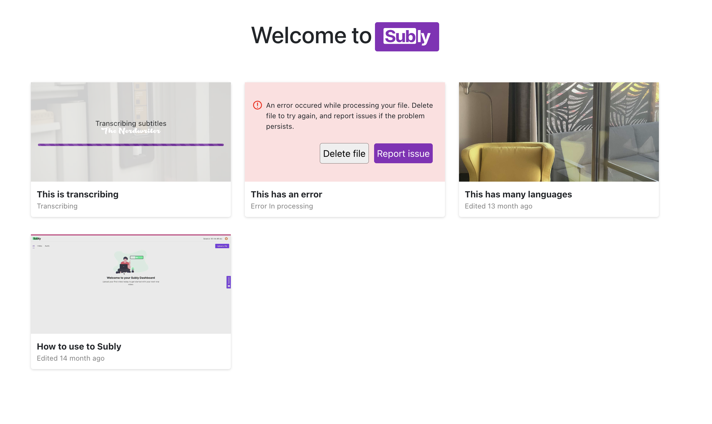

# Subly



### Technologies

TypeScript, ReactJS

### Live

Deployed via vercel [https://subly-bice.vercel.app/](https://subly-bice.vercel.app/)

### To start Project

```bash
npm install
```

```bash
npm run start
```

Open [http://localhost:3000](http://localhost:3000) with your browser to see the result.

### Architecture

App has 2 layer.
Haven't added one more layer between Infrastructure and presentation which can also provide state management

- ### Presentation(view)

  - Responsible showing content and handling component wise logic

- ### Infrastructure

  - Responsible handling data operations with servers

### Design decisions

- Parent and child components are inside one another in the folder structure. (makes them easy to find and understand the hierarchy)
- render of components are changing based on the props passed, so they can be reused passing different props in case of need. It prevent code duplication
